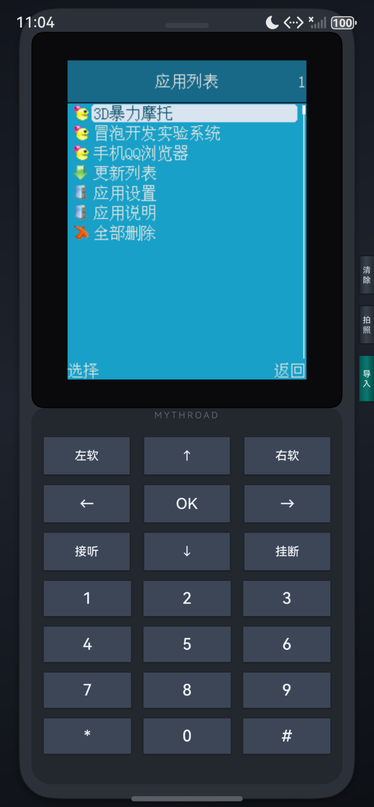

# mrpohos - HarmonyOS MRP 应用运行时

[](LICENSE)
[](https://developer.harmonyos.com/)
[](AppScope/app.json5)
[](https://github.com/Jiagu1218/mrpohos)

## 📱 项目简介

**mrpohos** 是一个运行在 HarmonyOS（鸿蒙系统）上的 MRP（MythRoad Platform）应用虚拟机/模拟器。它基于 **VMRP**（Virtual MythRoad Platform）和 **Unicorn** CPU 仿真引擎，能够在现代 HarmonyOS 设备（手机、平板）上运行传统的功能机 MRP 格式应用程序和游戏。

🔗 **项目地址**: https://github.com/Jiagu1218/mrpohos

该项目通过 Native C/C++ 层实现 ARM 指令集仿真、MRP 运行时桥接、图形渲染和音频合成，并通过 ArkTS/ETS 构建现代化的功能机风格 UI 界面。

## ✨ 核心特性

- **完整 MRP 运行时支持**：基于 VMRP 实现，兼容主流 MRP 应用和游戏
- **ARM CPU 仿真**：使用 Unicorn 引擎提供高性能 ARM 指令集仿真
- **实时 MIDI 音频**：集成 FluidSynth + OHAudio，支持原生 MIDI 音乐播放 （⚠️ 当前仅支持 arm64）
- **OpenGL ES 渲染**：通过 EGL/GLES2 实现 240x320 分辨率的游戏画面渲染（⚠️ 当前正在调试中）
- **GBK 编码支持**：完善的 GBK/UTF-8 转换，正确显示中文文本
- **震动反馈**：支持 MRP 应用的震动效果（OHVibrator）
- **文件导入**：支持从系统文件选择器导入 .mrp 文件到 mythroad 沙箱
- **经典功能机 UI**：模拟传统功能机外观，包含完整数字键盘和功能键
- **对话框系统**：支持 MRP 应用的文本框、输入框、确认对话框等 UI 元素

## 🏗️ 技术架构

### 技术栈

- **开发框架**：HarmonyOS API 12+ (Stage 模型)
- **UI 框架**：ArkTS / ETS (declarative UI)
- **Native 层**：C/C++ (CMake 构建)
- **CPU 仿真**：Unicorn Engine (ARM32)
- **音频引擎**：FluidSynth + OHAudio (实时 MIDI 合成)
- **图形渲染**：EGL + OpenGL ES 2.0
- **文本编码**：iconv-lite (GBK ↔ UTF-8)

### 项目结构

```
mrpohos/
├── AppScope/                  # 应用全局配置
│   ├── app.json5             # 应用元数据 (bundleName: com.example.mrpohos)
│   └── resources/            # 应用级资源
├── entry/                     # 主模块
│   ├── src/main/
│   │   ├── cpp/              # Native C/C++ 代码
│   │   │   ├── vmrp/         # VMRP 运行时核心
│   │   │   │   ├── bridge.c          # MRP API 桥接层
│   │   │   │   ├── vmrp.c            # 虚拟机主逻辑
│   │   │   │   ├── memory.c          # 内存管理
│   │   │   │   ├── fileLib.c         # 文件系统
│   │   │   │   ├── network.c         # 网络支持
│   │   │   │   ├── platform_harmony.c # HarmonyOS 平台适配
│   │   │   │   ├── gbk_conv.c        # GBK 编码转换
│   │   │   │   ├── harmony_vibrator.c # 震动反馈
│   │   │   │   ├── harmony_midi_audio_native.c  # MIDI 音频实现
│   │   │   │   └── header/           # 头文件
│   │   │   ├── unicorn/      # Unicorn CPU 仿真引擎
│   │   │   ├── thirdparty/   # 第三方库 (FluidSynth 等)
│   │   │   ├── CMakeLists.txt # Native 构建配置
│   │   │   ├── napi_init.cpp  # NAPI 模块初始化
│   │   │   └── mrp_gles_renderer.cpp # OpenGL ES 渲染器
│   │   ├── ets/              # ArkTS/ETS 前端代码
│   │   │   ├── entryability/ # Ability 入口
│   │   │   ├── pages/        # UI 页面
│   │   │   │   └── Index.ets # 主界面 (功能机模拟器 UI)
│   │   │   └── entrybackupability/ # 备份能力
│   │   ├── resources/        # 模块资源
│   │   ├── libs/arm64-v8a/   # 预编译原生库
│   │   └── module.json5      # 模块配置
│   ├── build-profile.json5   # 构建配置
│   └── oh-package.json5      # 依赖管理
├── openspec/                 # 规格文档
│   ├── changes/
│   │   └── harmony-realtime-midi-audio/ # MIDI 音频变更规格
│   └── specs/
└── hvigorfile.ts            # Hvigor 构建脚本
```

## 🚀 快速开始

### 前置要求

- **DevEco Studio** 6.0.2+ (推荐最新版本)
- **HarmonyOS SDK** API 12+
- **NDK** (用于 Native C/C++ 编译)
- **CMake** 3.5.0+
- 目标设备：HarmonyOS 手机或平板 (arm64-v8a 架构，x64 架构)

### 构建步骤

1. **克隆项目**
   ```bash
   git clone https://github.com/Jiagu1218/mrpohos.git
   cd mrpohos
   ```

2. **准备原生依赖** (可选：启用 MIDI 音频)
   
   如需启用实时 MIDI 播放，需将 FluidSynth 预编译库放置到：
   ```
   entry/src/main/cpp/thirdparty/fluidsynth/arm64-v8a/
   ├── include/
   │   └── fluidsynth.h
   └── lib/
       ├── libfluidsynth.so
       ├── libfluidsynth.so.3
       └── ... (传递依赖库)
   ```

3. **打开 DevEco Studio**
   - 选择 `File` → `Open`，打开项目根目录
   - 等待依赖同步完成 (`oh_modules`)

4. **配置构建选项**
   
   编辑 `entry/src/main/cpp/CMakeLists.txt`：
   ```cmake
   # 启用 Native MIDI 音频 (需预先放置 FluidSynth 库)
   option(VMRP_NATIVE_MIDI "Link FluidSynth+OHAudio for real-time MIDI playback" ON)
   ```

5. **构建并运行**
   - 连接 HarmonyOS 设备或启动模拟器
   - 点击 `Run` → `Run 'entry'`
   - 首次运行会自动部署 HAP 包

### 导入 MRP 应用

1. 启动应用后，点击机身右侧的 **"导入"** 侧键
2. 从系统文件选择器中选择 `.mrp` 文件
3. 文件将自动复制到 `mythroad/` 沙箱目录
4. 应用会自动加载默认的 `dsm_gm.mrp` 或 `start.mr`

## 🎮 使用说明

### 虚拟键盘布局




### 按键映射

| 虚拟按键 | MR 键码 | 功能说明 |
|---------|---------|---------|
| 左软 | `MR_KEYCODE_SOFTLEFT` (17) | 左软键/菜单 |
| 右软 | `MR_KEYCODE_SOFTRIGHT` (18) | 右软键/返回 |
| OK | `MR_KEYCODE_SELECT` (20) | 确认/选择 |
| ↑ ↓ ← → | 12-15 | 方向键 |
| 0-9 | 0-9 | 数字键 |
| * | `MR_KEYCODE_STAR` (10) | 星号键 |
| # | `MR_KEYCODE_POUND` (11) | 井号键 |
| 接听 | `MR_KEYCODE_SEND` (19) | 发送/确认 |
| 挂断 | `MR_KEYCODE_POWER` (16) | 电源/退出 |
| 清除 | `MR_KEYCODE_CLEAR` (23) | 删除/清除 |
| 拍照 | `MR_KEYCODE_CAPTURE` (26) | 相机快捷键 |

### 触摸控制

- 直接在屏幕区域触摸可模拟鼠标操作
- 支持按下、移动、抬起事件
- 坐标自动映射到 240x320 分辨率

## 🔧 开发指南

### Native 层开发

#### 添加新的 MRP API 桥接

在 `entry/src/main/cpp/vmrp/bridge.c` 中实现：

```c
// 示例：添加新的系统调用
int br_mr_newFunction(int param0, int param1) {
    // 实现逻辑
    HILOG_INFO("New function called");
    return 0;
}
```

#### 调试 Native 代码

1. 在 `build-profile.json5` 中启用 debug 模式
2. 使用 DevEco Studio 的 Native Debug 功能
3. 查看日志：
   ```bash
   hilog -t mrpohos
   ```

### ArkTS 层开发

#### 修改 UI 样式

编辑 `entry/src/main/ets/pages/Index.ets`：

```typescript
// 修改配色方案
const PHONE_SHELL = '#2c3139';        // 机身颜色
const KEY_FACE = '#3d4656';           // 按键颜色
const ACCENT_IMPORT = '#0a7a72';      // 强调色
```

#### 调整屏幕尺寸

```typescript
const SCREEN_WIDTH = 240;   // MRP 应用宽度
const SCREEN_HEIGHT = 320;  // MRP 应用高度
```

### 构建配置

#### CMake 选项

| 选项 | 默认值 | 说明 |
|------|--------|------|
| `VMRP_NATIVE_MIDI` | OFF | 启用 FluidSynth MIDI 音频 |
| `VMRP_FLUIDSYNTH_ROOT` | (自动检测) | FluidSynth 库路径 |
| `UNICORN_TARGET_ARCH` | aarch64 | Unicorn 目标架构 |
| `UNICORN_ARCH` | arm | 仿真的 CPU 架构 |

#### 权限声明

在 `entry/src/main/module.json5` 中已声明：

- `ohos.permission.INTERNET` - 网络访问
- `ohos.permission.VIBRATE` - 震动反馈

## 📋 已知限制

1. **OpenGL ES 渲染**：GLES 渲染路径仍在调试中，当前使用 CPU NativeBuffer 回退方案进行渲染
2. **MIDI 音频**：默认使用 stub 实现（无声音），需手动集成 FluidSynth 库才能启用
3. **非 MIDI 音效**：当前仅支持 `MR_SOUND_MIDI` 类型，其他音效类型为占位实现
4. **性能**：复杂 MRP 应用在低端设备上可能有性能问题
5. **网络**：部分 MRP 应用的网络功能可能受 HarmonyOS 沙箱限制

## 🛠️ 故障排除

### 常见问题

#### 1. 应用闪退，提示缺少 `.so` 库

**原因**：HAP 包中缺少 `libfluidsynth.so.3` 等依赖库

**解决方案**：
- 检查 `entry/src/main/cpp/thirdparty/fluidsynth/` 是否包含正确的预编译库
- 确认 `VMRP_NATIVE_MIDI` 配置与库文件存在性匹配
- 查看构建日志中的警告信息

#### 2. MRP 应用无法加载

**原因**：`mythroad/` 目录中缺少有效的 `.mrp` 文件

**解决方案**：
- 使用"导入"功能添加 MRP 文件
- 检查文件名是否为 `dsm_gm.mrp` 或 `start.mr`

#### 3. 中文显示乱码

**原因**：GBK 编码转换未正常工作

**解决方案**：
- 确认 `gbk_conv.c` 已正确编译链接
- 检查 MRP 文件的实际编码格式
- 查看日志中的编码转换错误

#### 4. 触摸响应不准确

**原因**：屏幕缩放比例计算错误

**解决方案**：
- 调整 `SCREEN_WIDTH` / `SCREEN_HEIGHT` 常量
- 检查 `xComponentWidth` / `xComponentHeight` 状态值

### 日志查看

```bash
# 查看应用日志
hilog -t mrpohos

# 查看 Native 层日志
hilog | grep -i "vmrp\|unicorn\|fluidsynth"

# 实时日志流
hilog -f
```

## 📄 许可证

### ⚠️ 重要提示

本项目使用了多个开源组件，它们的许可证**各不相同**：

| 组件 | 许可证 | 商业可用性 |
|------|--------|----------|
| **VMRP** | GPL-3.0 | 🔴 需开源整个项目 |
| **Unicorn Engine** | GPL-2.0/LGPL-2.0 | 🟡 动态链接可用 |
| **FluidSynth** | LGPL-2.1+ | ✅ 动态链接可用 |
| **mrpohos 自有代码** | GPL-3.0 | ✅ 已开源 |

### 详细说明

- **mrpohos 自有代码**遵循 GPL-3.0 许可证。详见 [LICENSE](LICENSE) 文件。
- **完整源码**: https://github.com/Jiagu1218/mrpohos
- **VMRP 子模块**使用 GPL-3.0 许可证，请参阅 `entry/src/main/cpp/vmrp/LICENSE`。
- **Unicorn Engine** 使用 GPL-2.0/LGPL-2.0 双重许可，请参阅 `entry/src/main/cpp/unicorn/COPYING`。
- **FluidSynth** 使用 LGPL-2.1+ 许可证，已动态链接，符合合规要求。

## 🙏 致谢

- **[VMRP](https://github.com/vmrp/vmrp)** - Virtual MythRoad Platform 核心运行时
- **[Unicorn Engine](https://www.unicorn-engine.org/)** - 轻量级多架构 CPU 仿真框架
- **[FluidSynth](https://www.fluidsynth.org/)** - 实时 MIDI 合成器
- **[fluidsynth](https://gitee.com/A00LiuBoyan/build-third-party/blob/master/fluidsynth/build/fluidsynth.tar.gz)** - 实时 MIDI 合成器 鸿蒙适配

## 📞 联系方式

- **GitHub**: https://github.com/Jiagu1218/mrpohos
- **Issue Tracker**: [GitHub Issues](https://github.com/Jiagu1218/mrpohos/issues)
- **Email**: <your-email@example.com>

---

**注意**：本项目仅供学习和研究用途。运行商业 MRP 应用前，请确保您拥有相应的版权许可。
